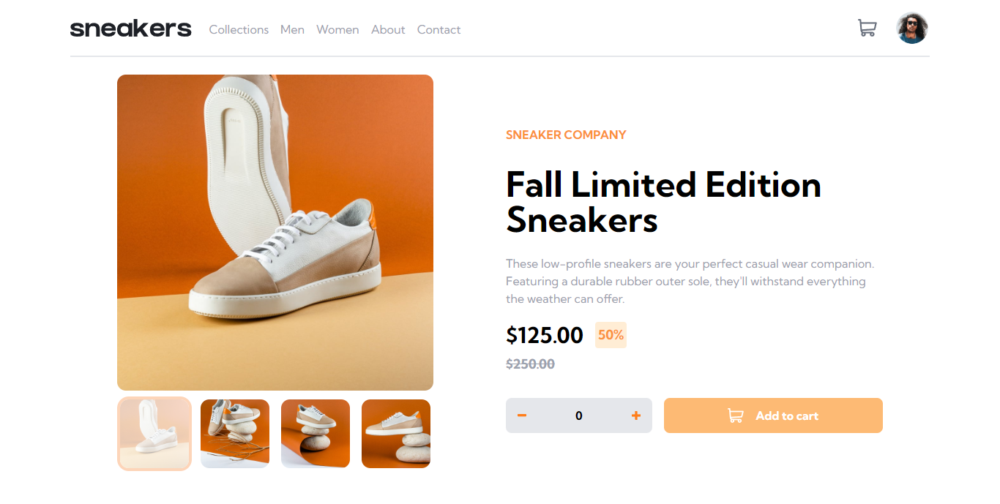

# Frontend Mentor - E-commerce product page solution

This is a solution to the [E-commerce product page challenge on Frontend Mentor](https://www.frontendmentor.io/challenges/ecommerce-product-page-UPsZ9MJp6). Frontend Mentor challenges help you improve your coding skills by building realistic projects.

## Table of contents

- [Overview](#overview)
  - [The challenge](#the-challenge)
  - [Screenshot](#screenshot)
  - [Links](#links)
- [My process](#my-process)
  - [Built with](#built-with)
  - [What I learned](#what-i-learned)
  - [Useful resources](#useful-resources)
- [Author](#author)

## Overview

### The challenge

Users should be able to:

- View the optimal layout for the site depending on their device's screen size
- See hover states for all interactive elements on the page
- Open a lightbox gallery by clicking on the large product image
- Switch the large product image by clicking on the small thumbnail images
- Add items to the cart
- View the cart and remove items from it

### Screenshot

### Links

- Solution URL: [https://www.frontendmentor.io/solutions/ecommerce-product-page-with-react-and-tailwind-mSd5RGEMwA](https://www.frontendmentor.io/solutions/ecommerce-product-page-with-react-and-tailwind-mSd5RGEMwA)
- Live Site URL: [https://e-product-alpha.vercel.app/](https://e-product-alpha.vercel.app/)

## My process

### Built with

- Semantic HTML5 markup
- Flexbox
- CSS Grid
- Mobile-first workflow
- [React](https://reactjs.org/) - JS library
- [Vite.js](https://vitejs.dev/) - Local development server
- [Tailwind](https://tailwindcss.com/) - For styles

### What I learned

This project taught me alot as I decided not to use any npm packages. Below are some:

- How to create a lightbox
- Creating a sidenav
- Creating a cart functionality including adding and removing items
- Improving image load times
  among others

### Useful resources

- [Tailwind Doc](https://www.tailwindcss.com/docs) - This helped me in styling the entire webpage and theres no saying how much I have come to love Tailwind.
- [Event Bubbling and even catching in JavaScript and React](https://www.freecodecamp.org/news/event-propagation-event-bubbling-event-catching-beginners-guide/#what-is-event-delegation) - This is an amazing article by [Mariya Diminsky](https://www.freecodecamp.org/news/author/mariya-diminsky/) which helped me finally understand event bubbling and why my parent onclick event was firing too. I'd recommend it to anyone still learning this concept or trying to figure it out.

## Author

- Frontend Mentor - [@Imhandegbelo](https://www.frontendmentor.io/profile/Imhandegbelo)
- Twitter - [@ImhandegebloG](https://www.twitter.com/ImhandegbeloG)
